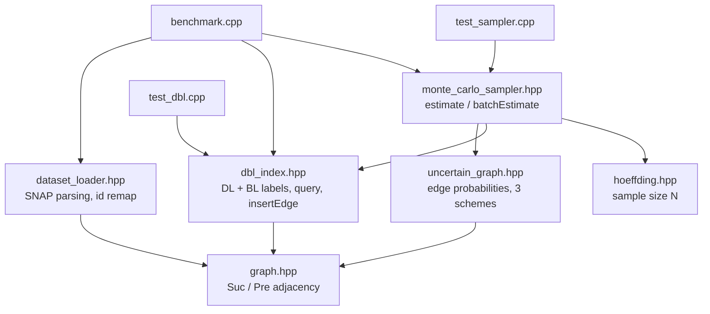
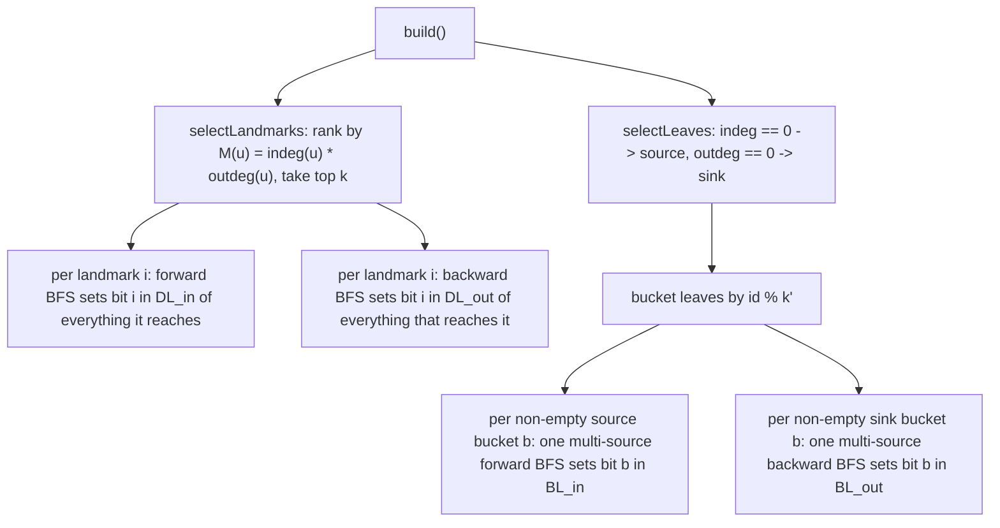
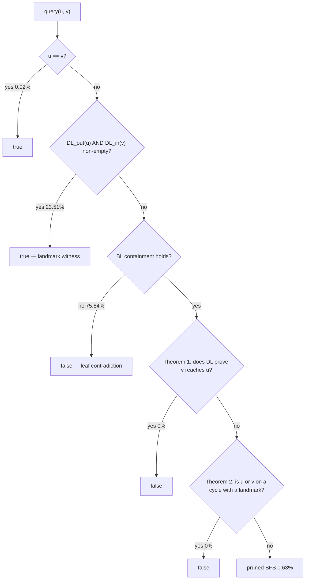
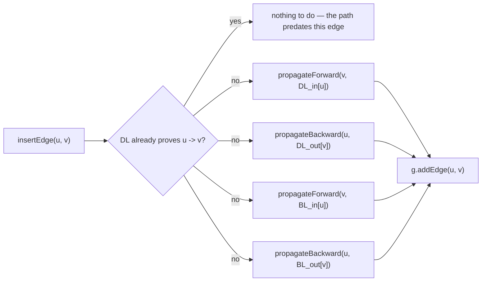
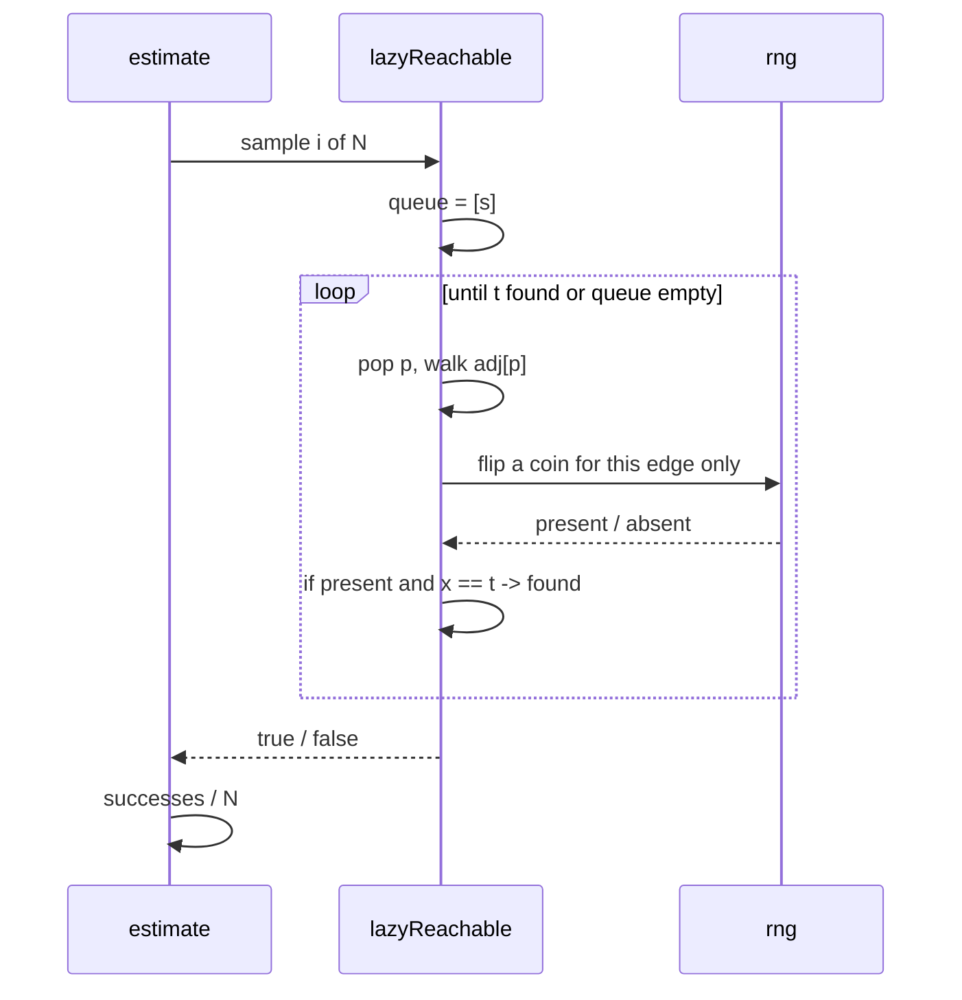

# Architecture

How the pieces fit together, why each one is shaped the way it is, and what the
measured behaviour on `wiki-Vote` looks like. The [README](../README.md) covers
what the project is and how to run it; this document covers how it works.

Every number quoted here comes from a run on the machine described in the
README's benchmark section: 7,115 vertices, 103,689 edges, `k = 64` landmarks,
`k' = 64` leaf buckets, 1M queries.

---

## 1. Layers

Everything except the three entry points is header-only, and the dependencies
run in one direction: graph representation at the bottom, the deterministic
index above it, the probabilistic layer above that.



Two design choices set the shape of the rest:

- **`Graph` stores both directions.** `Suc(u)` and `Pre(u)` are both materialised,
  because DBL walks backwards as often as forwards. It costs double the adjacency
  memory and makes a backward BFS exactly as cheap as a forward one.
- **`UncertainGraph` stores only an edge list.** It never traverses; it is
  iterated over. Anything that needs adjacency builds a `Graph` from it.

---

## 2. Building the index

`DBLIndex::build()` produces four label vectors, each a `std::bitset<128>` per
vertex: `DL_in`, `DL_out`, `BL_in`, `BL_out`. Both `k` and `k'` are clamped to
`[1, 128]`, since the bitset cannot hold more.



**Landmark selection** uses `M(u) = indeg(u) * outdeg(u)` as a cheap stand-in for
centrality: a vertex with many edges in and many out lies on many paths. The
score only ranks — with `k >= n` every vertex is a landmark and the ranking stops
mattering. Duplicate edges would corrupt these degrees, which is why the loader
drops them.

**Leaf bucketing** is what keeps the build cheap. `wiki-Vote` has 4,734 sources
and 1,005 sinks; one traversal per leaf would be 5,739 walks. Since every leaf in
a bucket sets the same bit, one multi-source BFS per bucket produces identical
labels — 128 walks instead of 5,739. The cost is collisions, discussed below.

Measured: index build takes 27.7 ms (median of 5 pinned runs).

---

## 3. Answering a query

The two labels are asymmetric, and that asymmetry is the whole design:

| Label | What a hit means | What it can prove |
|---|---|---|
| `DL` | a landmark `L` with `u -> L` and `L -> v` | **YES**, a witnessed path |
| `BL` | source/sink containment is broken | **NO**, no path can exist |

`DL` proves YES only: no shared landmark just means no *landmark-mediated* path.
`BL` proves NO only: if `u -> v` then every source reaching `u` reaches `v`, and
every sink `v` reaches is reachable from `u`, so broken containment rules the
pair out. Containment holding proves nothing — it is a necessary condition, and
bucket collisions weaken it further, since a set bit means "some leaf in this
bucket", not a specific one.



**The order is load-bearing.** Every step below the DL check argues from that
check having already returned false. Theorem 1: if `v -> L -> u` and `u -> v`
also existed, then `L` would sit in both `DL_out(u)` and `DL_in(v)`, so the DL
check would have fired. It didn't, so there is no `u -> v` path. Theorem 2 is the
same argument for a landmark cycle through `u` or through `v`. Both are sound
because DL labels are exact — they come from full BFS, with no hashing.

**The fallback** is a forward BFS from `u` that drops any neighbour `x` where
`dlIntersect(u, x)` holds (`x` is a dead end by the same argument as Theorem 1)
or where `BL` already rules out `x -> v`.

Measured over 1M queries: DL 23.51%, BL 75.84%, `u == v` 0.02%, pruned BFS 0.63%,
and both theorem exits **0** — on this dataset, everything they could catch, BL
caught first. Median throughput 91.5M queries/sec, 0.0109 µs per query.

---

## 4. Inserting an edge

Inserting `u -> v` can only make new pairs reachable, never fewer — bits are
ORed in and never cleared, which is why the index is insertion-only and deletion
is out of scope (the paper lists it as future work too).



Whatever reached `u` now reaches `v` and everything downstream of `v`; whatever
`v` reached is now reachable from `u` and everything upstream of `u`. That is the
whole update, in four symmetric calls.

**Propagation runs before the edge is added.** The set of affected vertices is
the same either way — the new edge cannot add a descendant to `v` that was not
already one, since any route through it returns to `v` — so walking the old
adjacency visits exactly the vertices whose labels can change, and never loops
back through the edge being inserted.

**Pruning rests on an invariant:** if a vertex carries a bit, all of its
descendants carry it too (and for the `_out` labels, all of its ancestors). So a
branch whose head already has the incoming bits can be cut — its descendants got
them by the same route. Build establishes the invariant; every propagation
preserves it.

`incoming` is passed by value because the caller hands over `label[u]`, an
element of the vector being written. It is 16 bytes, so the copy costs nothing
and keeps aliasing from becoming a precondition of future edits.

Measured: 0.36 µs per insertion, and after 2,000 insertions the index still
answers at 82.5M queries/sec with no rebuild. The reachable fraction over the
same 1M pairs moves from 0.2353 to 0.3238.

---

## 5. From a graph to an uncertain graph

Real datasets ship without probabilities, so `UncertainGraph::fromEdgeList`
assigns them by one of three schemes from the influence-maximisation literature:

| Scheme | Rule | Models |
|---|---|---|
| Uniform | fixed `p`, default 0.1 | a baseline where only structure varies |
| Trivalency | uniform draw from `{0.1, 0.01, 0.001}` | edges of genuinely different strength |
| WeightedCascade | `p(u, v) = 1 / indeg(v)` | a vertex with many in-edges is influenced less by each |

WeightedCascade needs two passes over the edge list: all in-degrees have to be
final before the first probability is assigned, or early edges get a probability
computed from a partial degree.

The number of samples is not a tuning knob. Given a target absolute error `ε` and
failure probability `δ`, Hoeffding's inequality gives

```
N >= ln(2 / δ) / (2 ε²)
```

which is independent of graph size: `ε = 0.02, δ = 0.05` needs 4,612 samples on
a four-vertex graph and on a four-million-vertex graph alike.

---

## 6. Monte Carlo estimation

There is no closed form for `P(s ⤳ t)`, so each estimate draws N possible worlds
and counts successes. The sampler has two paths, and they make opposite trades.

**`estimate(s, t)` — lazy, one pair.** It never materialises a world. A BFS walks
outward from `s` and flips an edge's coin only when the search actually arrives
at that edge.



Edges the search never reaches cannot lie on an `s-t` path, so their coins cannot
change the outcome — the result is distributed exactly as if the whole world had
been sampled first and then walked. On `wiki-Vote` this skips about 99% of the
coin flips. Two details make it fast in practice: `visited_` is reused across
samples and cleared through a `touched_` list rather than refilled, and a vertex
already visited short-circuits before its coin is drawn.

**`batchEstimate(queries)` — eager, many pairs.** It materialises each world,
builds a DBL index over it, and answers every query against that index. Indexing
a world costs up to `2k + 2k'` traversals against one BFS per pair, so it only
pays off once the query list runs into the thousands.

**The resolution floor.** With `N = 4,612` the smallest non-zero estimate is
`1/4612 ≈ 2.2e-4`. WeightedCascade's average `p` on this graph is about 0.023, so
a three-hop path carries roughly `1.2e-5` — nearly 20x below the floor, and the
scheme reports exactly `0.0000`. That is the estimator's resolution, not a bug:
Hoeffding bounds *absolute* error, and an estimator that always returned 0 would
satisfy it at this ε. Resolving probabilities that small needs a relative-error
method. Trivalency is the contrast: a comparable average `p`, but a three-hop
path whose edges all drew 0.1 carries `1e-3`, comfortably above the floor, so it
estimates 0.0076.

Measured per query: Uniform 33.9 ms, Trivalency 9.92 ms, WeightedCascade 0.222 ms
— lower probabilities make the search die out sooner, so less of each world is
ever explored.

---

## 7. Correctness and known gaps

`test_dbl.cpp` checks 3,823,036 pairs against a deliberately naive BFS: no
labels, no pruning, nothing that could share a bug with the index. Seven blocks
cover static graphs, insertions into an empty index, insertions into a populated
one (all-pairs after *every* insert, ~95% of the total work, so a later insert
cannot mask an earlier wrong answer), a 2,000-vertex graph sampled at 5,000
pairs, and three blocks for paths the others never reach: the theorem exits,
self-loop insertion, and the `k` / `k'` clamp. Cases are deliberately sparse
with small `k` and `k'`, because a dense graph with generous labels lets DL
answer everything and leaves BL and the fallback untested.

Three of those blocks were added to close gaps this document previously listed:

- **The theorem exits** need a graph with no sources and no sinks, which leaves
  every BL label empty so `blContain` can never rule a pair out and the query
  falls through to them. Two 2-cycles joined one way, plus a detached 2-cycle,
  reach Theorem 1 four times and Theorem 2 sixteen times.
- **Self-loop insertion** is exercised directly, interleaved with ordinary
  insertions so a label left stale by `insertEdge(u, u)` would show up.
- **The `k` / `k'` clamp** is asserted through `landmarks()`, which exposes the
  clamped `k`, rather than inferred from the absence of a crash. Removing the
  clamp makes the suite die with SIGFPE, because `k' = 0` turns the bucket
  hash's `leafId % kp_` into a division by zero.

`test_sampler.cpp` checks the estimates against exact reachability computed by
enumerating all `2^|E|` worlds of a 6-edge graph, covers `batchEstimate`
separately because it is a different code path, and asserts that
`hoeffdingSampleSize` rejects out-of-range arguments — NaN among them, which the
earlier negated-form guards let through into a `static_cast<uint64_t>` that is
undefined behaviour for it.

What the suite still cannot do:

- **Deletions are not supported** at all; label bits are never cleared, so there
  is nothing to test.
- **The theorem exits cannot be pinned by output.** Both are shortcuts: delete
  either one and the pruned BFS returns the same answer, so the suite stays
  green. Mutating them measurably — moving Theorem 1 above the DL check, or
  making Theorem 2 return `true` — is caught, at 6 and 16 mismatches. Their
  correctness is testable; their execution is not, short of instrumenting the
  header.
